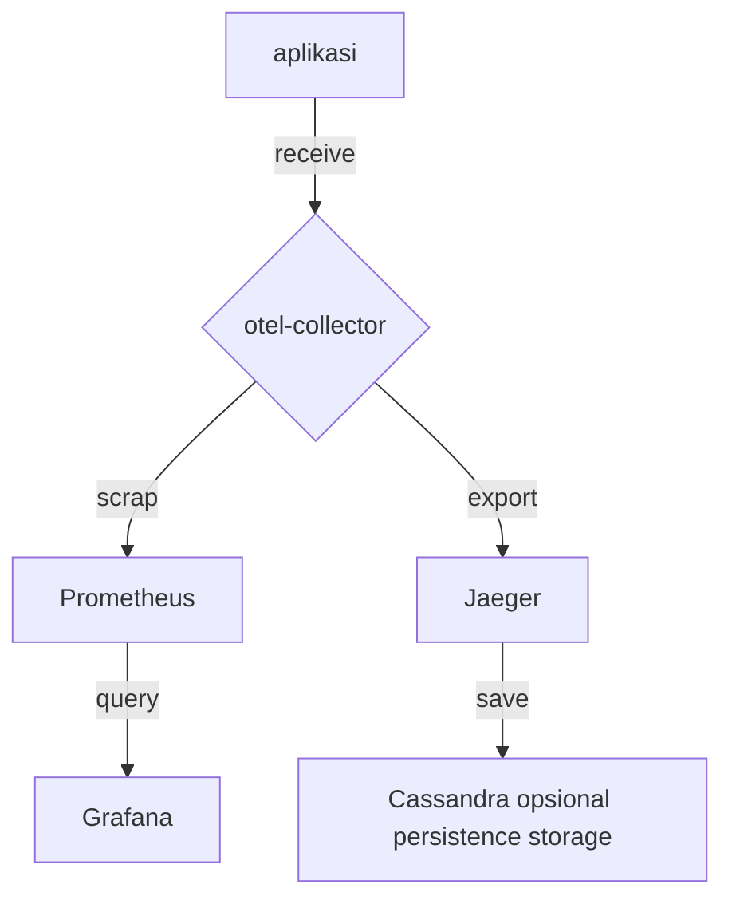

# Otel Collector For Traces and Metrics Demo

```mermaid
graph TD
A[aplikasi] -->|receive| O{otel-collector}
O{otel-collector} --> |scrap| P[Prometheus]
O{otel-collector} --> |export| J[Jaeger]
P[Prometheus] --> |query| G[Grafana]
J[Jaeger] --> |save| C[Cassandra opsional persistence storage]
```

## How to run:
  - docker compose up -d
  - pip install -r requirements.txt
  - python3 main.py
